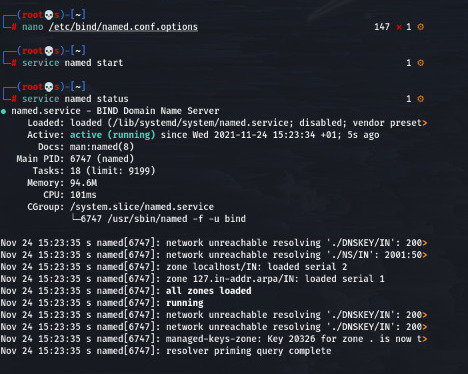
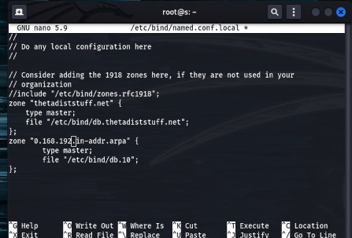
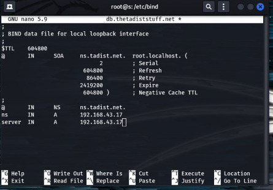
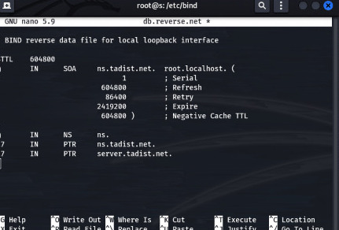

# Domain Name System Protocol

## Part 1 : DNS configuration

# 1. DNS definition, role and functionality.

Domain Name Service (DNS) is an internet service that maps IP addresses to fully qualified domain names (FQDN) and vice versa.
role 
functionality
# 2. the different DNS servers.


# 3. Explain the DNS server’s configuration steps.
   - ## Configure the name.conf.
   
   Install the bind9(or named) package using the appropriate package management utilities for your Linux distributions.
   ```
    $ sudo apt-get install bind9
   ```
   All we have to do to configure a Cache NameServer is to add your ISP (Internet Service Provider)’s DNS server or any OpenDNS server to the file /etc/bind/named.conf.options. For Example, we will use google’s public DNS servers, 8.8.8.8 and 8.8.4.4.
   Uncomment and edit the following line as shown below in /etc/bind/named.conf.options file.
   ```
   forwarders {
    8.8.8.8;
    8.8.4.4;
};
   ```
   After the above change, start the DNS server.
   
   
   
   - ## Create and configure zone files.

To add a DNS Forward and Reverse resolution to bind9, edit /etc/bind9/named.conf.local.



Now we will add the details which is necessary for forward resolution into /etc/bind/db.thetadiststuff.net.copy file /etc/bind/db.local to /etc/bind/db.thetadiststuff
```
cp db.local  db.thetadiststuff
nano db.thetadiststuff
```


We will add the details which are necessary for reverse resolution to the file /etc/bind/db.reverse. Copy the file /etc/bind/db.127 to /etc/bind/db.reverse
```
cp db.127  db.reverse
nano db.reverse
```


   - ## Verify the configuration.
    
# 4. Configure the DNS Client.
# 5. Configure primary and secondary DNS servers.
   -  ## Configure the primary DNS server as a master.
   -  ## Configure the secondary DNS server as a slave.
   -  ## Test the configuration by stopping the master DNS.
