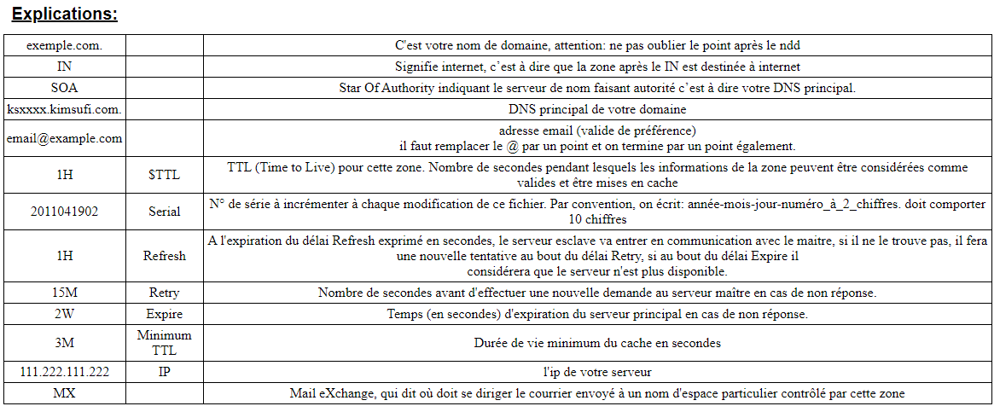
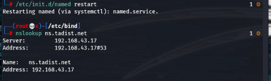
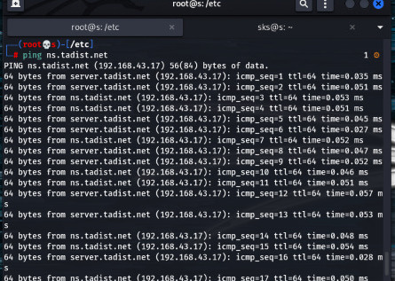
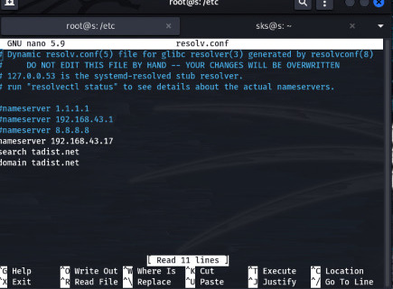

# Domain Name System Protocol

## Part I : DNS configuration


# 1. DNS definition, role and functionality.
(Domain Name System) The Internet's system for converting alphabetic names into numeric IP addresses. For example, when a Web address (URL) is typed into a browser, DNS servers return the IP address of the Web server associated with that name.
Domain Name Service (DNS) is an internet service that maps IP addresses to fully qualified domain names (FQDN) and vice versa.

# 2. the different DNS servers.

The three DNS server types server are the following: DNS stub resolver server. DNS recursive resolver server. DNS authoritative server.

# 3. Explain the DNS server’s configuration steps.
   - ## Configure the name.conf.
   
   Install the bind9(or named) package using the appropriate package management utilities for your Linux distributions.
   ```
    $ sudo apt-get install bind9
   ```
   All we have to do to configure a Cache NameServer is to add your ISP (Internet Service Provider)’s DNS server or any OpenDNS server to the file /etc/bind/named.conf.options. For Example, we will use google’s public DNS servers, 8.8.8.8 and 8.8.4.4.
   Uncomment and edit the following line as shown below in /etc/bind/named.conf.options file.
   ```
   forwarders {
    8.8.8.8;
    8.8.4.4;
};
   ```
   After the above change, start the DNS server.
   
   
   
   - ## Create and configure zone files.

To add a DNS Forward and Reverse resolution to bind9, edit /etc/bind9/named.conf.local.


Now we will add the details which is necessary for forward resolution into /etc/bind/db.thetadiststuff.net.copy file /etc/bind/db.local to /etc/bind/db.thetadiststuff
```
cp db.local  db.thetadiststuff
nano db.thetadiststuff
```


We will add the details which are necessary for reverse resolution to the file /etc/bind/db.reverse. Copy the file /etc/bind/db.127 to /etc/bind/db.reverse
```
cp db.127  db.reverse
nano db.reverse
```

## Explication



   - ## Verify the configuration.
     Finally, restart the bind9(or named) service:
     
       
       
       
       
# 4. Configure the DNS Client.

Local name resolution is done via /etc/hosts file. If you have small network, use /etc/hosts file. DNS (domain name service is accountable for associating domain names with ip address, for example domain yahoo.com is easy to remember than IP address 202.66.66.12) provides better name resolution. To configure Linux as DNS client you need to edit or modify /etc/resolv.conf file. This file defines which name servers to use. You want to setup Linux to browse net or run network services like www or smtp; then you need to point out to correct ISP DNS servers:

## /etc/resolv.conf file

In Linux and Unix like computer operating systems, the /etc/resolv.conf configuration file contains information that allows a computer connected to the Internet to convert alpha-numeric names into the numeric IP addresses that are required for access to external network resources on the Internet. The process of converting domain names to IP addresses is called “resolving.”

The resolv.conf file typically contains the IP addresses of nameservers (DNS name resolvers) that attempt to translate names into addresses for any node available on the network.

## Setup DNS Name resolution
Steps to configure Linux as DNS client, first login as a root user (use su command):

**Step # 1**: Open /etc/resolv.conf file:

`# vi /etc/resolv.conf`

**Step #2**: Add your ISP nameserver as follows:
```
search isp.com
nameserver 202.54.1.110
nameserver 202.54.1.112
nameserver 202.54.1.115
```
Note Max. three nameserver can be used/defined at a time.

**Step #3**:Test setup nslookup or dig command:
```
$ dig www.nixcraft.com
$ nslookup www.nixcraft.com
```   
the previous configuration is explained by this exemple:



# 5. Configure primary and secondary DNS servers.
   -  ## Configure the primary DNS server as a master.
   Here are the steps to configure DNS master-slave server in Linux. Here is our setup.
   ```
   Master DNS Server IP: 54.43.32.21 ( ns1.example.com )
Slave  DNS Server IP: 54.43.32.22 ( ns2.example.com )
Domain Name : example.com   ( For Testing Purpose )
Domain IP   : 54.43.32.20  ( For Testing Purpose )
   ```
   Open terminal and run the following command to open named.conf file.
   `$ vi /var/named/chroot/etc/named.conf`
   Update listen-on and allow-query variables’ values in the options block as shown with the address CIDR for your server, shown in bold.
   ```
   options {
        listen-on port 53 { 127.0.0.1; 54.43.32.0/24; };
 ...
        allow-query     { localhost; 54.43.32.0/24; };
        recursion yes;

 ...
};
   ```
   We need to create separate zone for each of our domain. Since we have only 1 domain example.com, we create zone file for it.\
   
   
   `$ vi /var/named/chroot/var/named/example.com.db`
   
   Add the following lines to it. Replace example.com with your domain name, ns1.example.com with subdomain of your master, ns2.example.com with subdomain of your slave.
   ```
   ; Zone file for example.com
$TTL 14400
@      86400    IN      SOA     ns1.example.com. webmaster.example.com. (
                3215040200      ; serial, todays date+todays
                86400           ; refresh, seconds
                7200            ; retry, seconds
                3600000         ; expire, seconds
                86400 )         ; minimum, seconds

example.com. 86400 IN NS ns1.example.com.
example.com. 86400 IN NS ns2.example.com.
example.com. IN A 192.168.1.100
example.com. IN MX 0 example.com.
mail IN CNAME example.com.
www IN CNAME example.com.
```
Now we need to add details of this zone file in our named.conf file updated in previous step. Open it again in text editor and add the following lines. Replace example.com with your domain name.

```
zone "example.com" IN {
        type master;
        file "/var/named/example.com.db";
	allow-update { none; };
};
```
Save and close the file. Run the following command to start named service.
```
$ /etc/init.d/named restart
$ chkconfig named on
```

   
   -  ## Configure the secondary DNS server as a slave.

Now we need to configure Slave DNS server. In this case, we need to update only named.conf file. All changes made on Master will be automatically synced with its slaves at regular intervals of time. Open named.conf file in text editor.

`$ vi /var/named/chroot/etc/named.conf`

In this case also, update listen-on and allow-query variables’ values in the options block as shown with the address CIDR for your server, shown in **bold**.
```
options {
        listen-on port 53 { 127.0.0.1; 54.43.32.0/24; };
 ...
        allow-query     { localhost; 54.43.32.0/24; };
        recursion yes;

 ...
};
```
Start named service with the following command.

```
$ /etc/init.d/named restart
$ chkconfig named on
```
After restarting named service, you will be able to see zone files in slave DNS at /var/named/chroot/var/named/slaves/.
   -  ## Test the configuration by stopping the master DNS.
   Now you can query your DNS master & slaves with the following command.
   
   `nslookup <domainname.com> <dns server name/ip>`
   
   You should get the same response from both of them. Here’s the query to Master DNS server.
   ```
   $ nslookup example.com 54.43.32.21

Server:         54.43.32.21
Address:        54.43.32.21#53

Name:   example.com
Address: 54.43.32.20
```
The above output shows that both DNS master and slave have correctly resolved domain example.com. In this article, we have learnt how to setup DNS Master-Slave server. You can customize it according to your requirements. Although the above steps are for RHEL/Fedora/CentOS, you can also use it for Ubuntu/Debian Linux.

# Part II : DDNS configuration

1. Configure the DDNS server.

a. Install the necessary packages.

Install all bind and dhcp packages
```
#yum install bind bind-chroot dhcpd net-toools  bind-utils -y
```
 Enable both the service in required run levels
 
```
#chkconfig named on
#chkconfig dhcpd on
```
b. Configure the forward and reverse zones.

Copy the sample bind configuration file under chroot environment. It will reflected automatically under /etc.

```
  # cp /usr/share/doc/bind-9.11.4/sample/etc/named.conf   /var/named/chroot/etc/
  # vi  /etc/named.conf
```
```
options {
        listen-on port 53 { 192.168.56.101; };
        listen-on-v6 port 53 { ::1; };
        directory       "/var/named";
        dump-file       "/var/named/data/cache_dump.db";
        statistics-file "/var/named/data/named_stats.txt";
        memstatistics-file "/var/named/data/named_mem_stats.txt";
        recursing-file  "/var/named/data/named.recursing";
        secroots-file   "/var/named/data/named.secroots";
        allow-query     { localhost; 192.168.56.0/24; };
        allow-query-cache { localhost; 192.168.56.0/24; };

        /*
         - If you are building an AUTHORITATIVE DNS server, do NOT enable recursion.
         - If you are building a RECURSIVE (caching) DNS server, you need to enable
           recursion.
         - If your recursive DNS server has a public IP address, you MUST enable access
           control to limit queries to your legitimate users. Failing to do so will
           cause your server to become part of large scale DNS amplification
           attacks. Implementing BCP38 within your network would greatly
           reduce such attack surface
        */

        recursion yes;

#       dnssec-enable yes;
#       dnssec-validation yes;

        /* Path to ISC DLV key */
#       bindkeys-file "/etc/named.root.key";
#       managed-keys-directory "/var/named/dynamic";
#       pid-file "/run/named/named.pid";
#       session-keyfile "/run/named/session.key";
};

/* Forward Lookup Zone */
zone "example.com" {
type master;
file "example.com.zone";
notify no;
allow-query { any; };
allow-update { 192.168.56.101; }; /* this should be dhcp server address*/
};

/* Reverse Lookup Zone */
zone "56.168.192.in-addr.arpa" {
type master;
file "56.168.192.in-addr.arpa.zone";
notify no;
allow-query { any; };
allow-update { 192.168.56.101; };
};
```

Creating Zone Files

Zone file are the one holds mapping between IP address and System names. The named daemon refers these two files for any query.

1. Forward lookup zone
```
[root@dns-dhcp ~]# cat /var/named/example.com.zone

$TTL 86400      ; 1 day

@             IN SOA  dns-dhcp.example.com. root.example.com. (
                                123        ; serial
                                10800      ; refresh (3 hours)
                                900        ; retry (15 minutes)
                                604800     ; expire (1 week)
                               86400      ; minimum (1 day)
                                )

                        NS      dns-dhcp.example.com.
                        A       192.168.56.101
client1                 A       192.168.56.102
dns-dhcp                A       192.168.56.101
```

2. Reverse lookup zone

```
[root@dns-dhcp ~]# cat /var/named/56.168.192.in-addr.arpa.zone

$TTL 86400      ; 1 day
@                            IN SOA  56.168.192.in-addr.arpa. root.example.com. (
                                77         ; serial
                                86400      ; refresh (1 day)
                                3600       ; retry (1 hour)
                                604800     ; expire (1 week)
                               10800      ; minimum (3 hours)
                                )

                        NS      dns-dhcp.example.com.
                        A       192.168.56.101
101                     PTR     dns-dhcp.example.com.
102                     PTR     client1.example.com.
```
## Verify configured files
```
#named-checkconf /etc/named.conf
#named-checkzone example.com /var/named/example.com.zone
# named-checkzone 56.168.192.in-addr.arpa /var/named/56.168.192.in-addr.arpa.zone
#service named restart
```
Check named server status

`#rndc status`

Configure DHCP server

copy sample dhcp configuration file and do below changes.

`#cp /usr/share/doc/dhcp*/dhcpd.conf.sample /etc/dhcp/dhcpd.conf`
```
[root@dns-dhcp ~]# cat /etc/dhcp/dhcpd.conf

option domain-name "example.com";
option domain-name-servers dns-dhcp.example.com;
default-lease-time 600;
max-lease-time 7200;

# Use this to enble / disable dynamic dns updates globally.
ddns-update-style interim;
ddns-updates on;
ignore client-updates;
update-static-leases on;
ddns-domainname "example.com";
server-identifier dns-dhcp.example.com;

# If this DHCP server is the official DHCP server for the local
# network, the authoritative directive should be uncommented.

authoritative;

# Use this to send dhcp log messages to a different log file (you also
# have to hack syslog.conf to complete the redirection).
#log-facility local7;

/* Zone Declaration for Dynamic Update */
zone example.com. {
primary 192.168.56.101;
}

zone 56.168.192.in-addr.arpa. {
primary 192.168.56.101;
}

subnet 192.168.56.0 netmask 255.255.255.0 {
                                                range 192.168.56.21 192.168.56.40;
                                                option domain-name-servers 192.168.56.101;
                                                option domain-name "example.com";
                                                option routers 192.168.56.101;
                                                option broadcast-address 192.168.56.255;
                                                default-lease-time 600;
                                               max-lease-time 7200;
                                        }
 
```
now we restart the DHCP server

`#service dhcpd  restart`

route internal packet to external network 

at first enable ip forwarding
```
# echo 1 > /proc/sys/net/ipv4/ip_forward
reset iptables rules
# iptables -F
# iptables -t nat -F
```
allow forwarding from the local network

`iptables -A FORWARD -i eth0 -o wth0 -j ACCEPT`

allow responses back in

`iptables -A FORWARD -i wth0 -o eth0 -m state --state RELATED,ESTABLISHED -j ACCEPT`

masquerade the ip address

`iptables -t nat -A POSTROUTING -o wth0 -j MASQUERADE`

make routing changes persistent

`/etc/sysctl.conf and uncommenting the net.ipv4.ip_forward = 1`

should install iptables-services package.

Then service iptables save will work. Also these commands will work too:
```
# iptables-save > /etc/sysconfig/iptables
# ip6tables-save > /etc/sysconfig/ip6tables
```

2. Configure the client.
  Update resolver details
  
  `#vi /etc/resolv.conf`
  ```
  nameserver 192.168.56.101
DOMAIN=example.com

  ```
On all other client machines (rhel2.example.com) remove static IP if there is any, configure boot protocol as DHCP and restart network service.

`#vi /etc/sysconfig/network-scripts/ifcfg-etho`

`BOOTPROTO=dhcp`

4. Verify the configuration

#nslookup rhel2.example.com
``` 
Server:      192.168.56.101
Address:     192.168.56.101 #53

Name:   dns-dhcp.example.com
Adress: 192.168.56.101
```

#nslookup 192.168.1.22
```
56.168.192.in-addr.arpa	    name = dns-dhcp.example.com.
56.168.192.in-addr.arpa	    name = client1.example.com.
```

